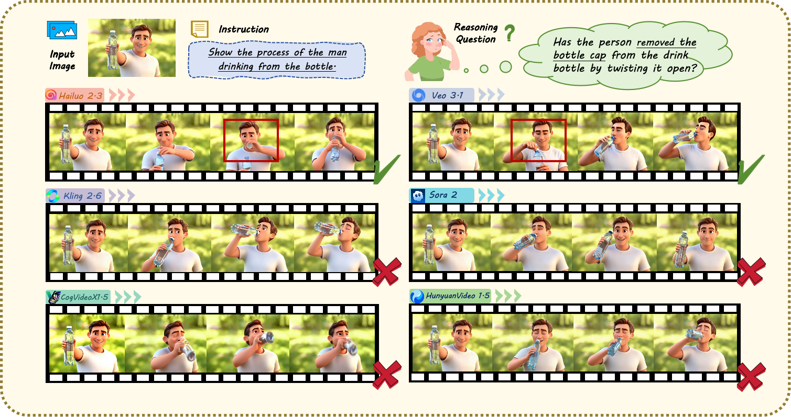
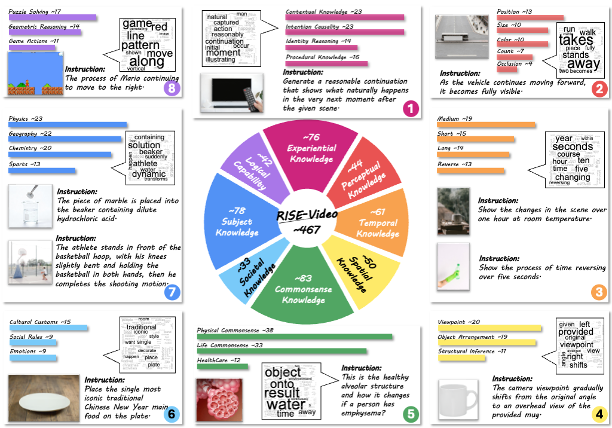
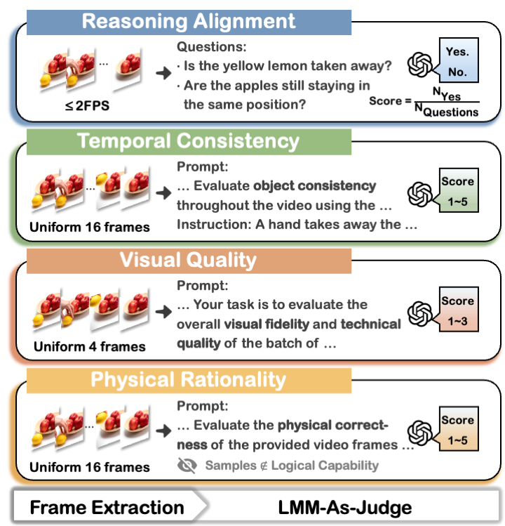
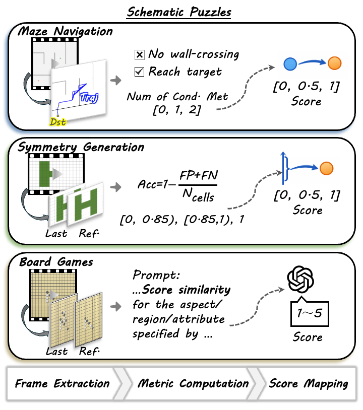

<div align="center">

# 🎥 RISE-Video: Can Video Generators Decode Implicit World Rules? 

[Mingxin Liu](https://github.com/123sio),
[Shuran Ma](https://github.com/sookiemm),
[Shibei Meng](https://dreamshibei.github.io),
[Xiangyu Zhao](https://scholar.google.com/citations?user=eqFr7IgAAAAJ&hl=zh-TW&oi=ao),

[Zicheng Zhang](https://zzc-1998.github.io/),
[Shaofeng Zhang](https://sherrylone.github.io/),
[Zhihang Zhong](https://zzh-tech.github.io/),
[Peixian Chen](https://scholar.google.com/citations?user=WRGF9B8AAAAJ&hl=zh-CN),

[Haoyu Cao](https://scholar.google.com/citations?hl=zh-CN&user=LV8ejn8AAAAJ),
[Xing Sun](https://scholar.google.com/citations?hl=zh-CN&user=IUtix9IAAAAJ),
[Haodong Duan](https://kennymckormick.github.io/),
[Xue Yang](https://yangxue.site/)

</div>

<p align="center">
  <a href='https://arxiv.org/abs/2602.05986'>
    
  </a>
  <a href='https://huggingface.co/datasets/VisionXLab/RISE-Video'>
    
  </a>

<div align="center">
  
</div>

## Introduction

<div align="center">
  
</div>
    

We present RISE-Video, a pioneering reasoning-oriented benchmark for Text-Image-to-Video (TI2V) synthesis that shifts the evaluative focus from surface-level aesthetics to deep cognitive reasoning. 

RISE-Video comprises 467 meticulously human-annotated samples spanning eight rigorous categories: *Commonsense Knowledge*, *Subject Knowledge*, *Perceptual Knowledge*, *Societal Knowledge*, *Logical Capability*, *Experiential Knowledge*, *Spatial Knowledge*, *Temporal Knowledge*, providing a structured testbed for probing model intelligence across diverse dimensions.
 
 Our framework introduces a multi-dimensional evaluation protocol consisting of four metrics: *Reasoning Alignment*, *Temporal Consistency*, *Physical Rationality*, and *Visual Quality*.  To further support scalable evaluation, we propose an automated pipeline leveraging Large Multimodal Models (LMMs) to emulate human-centric assessment. 

<table border="0" cellspacing="0" style="border-collapse: collapse;">
  <tr>
    <td align="center" style="border: none; padding: 8px;"> 
       
      <br/> 
      Evaluation pipeline
    </td>
    <td align="center" style="border: none; padding: 8px;">
      
      <br/>
      Specialized Evaluation Pipeline
    </td>
  </tr>
</table>

## 📊 Scoreboard

We conduct a comprehensive evaluation on 11 representative TI2V models, revealing systematic reasoning limitations and providing insights into current model capabilities.

<div align="center">
  
| Models | 🧠 RA | 👣 TC | 🔭 PR | 👀 VQ | W.Score | Accuracy |
|-------|----|----|----|----|--------|----------|
|  Hailuo2.3 🥇 | 76.6% | 87.2% | 71.0% | 92.0% | 79.4% | 22.5% |
|  Veo3.1 🥈 | 64.9% | 86.0% | 78.9% | 91.9% | 76.4% | 22.3% |
|  Sora-2 🥉 | 64.0% | 92.2% | 76.3% | 92.2% | 77.0% | 21.3% |
|  Wan2.6 | 70.0% | 88.8% | 72.5% | 94.5% | 77.8% | 21.3% |
|  Kling2.6 | 53.7% | 86.4% | 78.0% | 95.1% | 72.1% | 19.5% |
|  Seedance1.5-pro | 61.2% | 81.1% | 70.7% | 96.2% | 72.0% | 17.6% |
|  Wan2.2-I2V-A14B | 39.5% | 79.2% | 75.4% | 94.0% | 63.9% | 11.4% |
|  HunyuanVideo-1.5-720P-I2V | 38.1% | 75.0% | 68.4% | 92.6% | 60.4% | 8.6% |
|  HunyuanVideo-1.5-720P-I2V-cfg-distill | 38.9% | 74.0% | 65.8% | 92.9% | 59.9% | 7.3% |
|  Wan2.2-TI2V-5B | 32.6% | 70.5% | 72.8% | 89.7% | 57.8% | 5.4% |
|  CogVideoX1.5-5B | 30.7% | 62.3% | 56.7% | 74.5% | 49.5% | 1.9% |

</div>

*RA: Reasoning Alignment; TC: Temporal Consistency; PR: Physical Rationality; VQ: Visual Quality; W.Score: Weighted Score (computed by assigning weights of 0.4, 0.25, 0.25, and 0.1 to Reasoning Alignment, Temporal Consistency, Physical Rationality, and Visual Quality).*

## 💪 Get Started

### 🤖 Video Gneneration

The first frame and text prompt for video generation are [here](https://huggingface.co/datasets/VisionXLab/RISE-Video/blob/main). The generated videos should be organized in the form of:

`{MODEL NAME}/{CATEGORY}/{TASK_ID}`
- `MODEL NAME`: Generation model.
- `CATEGORY`: The category of the sample (e.g., `Subject Knowledge`).
- `TASK_ID`: The unique ID of each sample (corresponding to the `"task_id"` field in the [JSON](https://huggingface.co/datasets/VisionXLab/RISE-Video/blob/main/v5.json)).

All video paths must be written into the `"video_path"` field of the [JSON](https://huggingface.co/datasets/VisionXLab/RISE-Video/blob/main/v5.json).

### 🎬 Frame Extraction

To generate the video frames required for the *Reasoning Alignment* dimension and facilitate visualization. First, configure the path to the JSON file containing the `"video_path"` field and the frame storage path in the `data_json` and `root_folder` parameters [here](reasoning_fps/fps_clip.py).
Then, run the following code to extract and store the frames:

```
cd reasoning_fps
python fps_clip.py
```
The extracted and saved frames will be automatically written into the `"frame_path"`.

### 🎯 Evaluation

Configure the parameters [here](eval.py):

- `data_json`: Path to video result json with `"frame_path"`.
- `root_dir`: Intermediate file storage root directory.
- `relax_save_root`: The root directory for the storage file of the model's weighted scores.
- `strcit_save_root `: The root directory for the storage file of the model's accuracy.
- `GPT_URL`: Your OpenAI API base URL.
- `GPT_KEY`: Your OpenAI API key.

And then run:
```
python eval.py
```
You can then view the video evaluation results and scores in the corresponding folder.

## Citation
```
@misc{liu2026risevideovideogeneratorsdecode,
      title={RISE-Video: Can Video Generators Decode Implicit World Rules?}, 
      author={Mingxin Liu and Shuran Ma and Shibei Meng and Xiangyu Zhao and Zicheng Zhang and Shaofeng Zhang and Zhihang Zhong and Peixian Chen and Haoyu Cao and Xing Sun and Haodong Duan and Xue Yang},
      year={2026},
      eprint={2602.05986},
      archivePrefix={arXiv},
      primaryClass={cs.CV},
      url={https://arxiv.org/abs/2602.05986}, 
}
```
